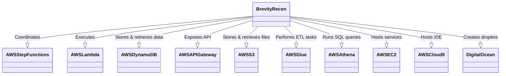

# Project: BrevityRecon Automation System on AWS

## By David Cannan
[MyGithubProject](https://github.com/Cdaprod/brevityrecon)

### Summary

This project was a deep exploration into cloud computing, infrastructure as code, and software engineering. Using the BrevityRecon tool as a foundation, I designed and implemented a comprehensive automation system using various AWS services. The system was designed to automate bug bounty reconnaissance tasks, improve efficiency, and enhance the discovery of potential vulnerabilities.

The project involved a broad range of skills, including full-stack development, DevOps, NoSQL database management, data ETL processes, secure API design, and cloud computing. One of the central components of this project was AWS Step Functions, a serverless workflow service, which was used to coordinate various tasks and ensure seamless operation. In addition to that, AWS Lambda was extensively utilized to run code without provisioning or managing servers. I also implemented a serverless REST API using AWS API Gateway and AWS Lambda, demonstrating my capabilities in back-end development and secure API design.

Data management played a critical role in this project. I worked with AWS DynamoDB, a key-value and document database that delivers single-digit millisecond performance at any scale. I also leveraged AWS Glue for ETL (Extract, Transform, Load) tasks and used AWS Athena for interactive query services. 

In terms of cloud infrastructure, I utilized AWS Cloud9 as a cloud-based integrated development environment (IDE) that lets you write, run, and debug code with just a browser. I also leveraged DigitalOcean to create and manage droplets in the cloud.

One of the exciting aspects of this project was the forward-thinking approach I took. I prepared the system for future GraphQL integration, indicating my commitment to leveraging the latest technologies and trends in the industry. 

Overall, this project showcased my comprehensive software engineering skills, including my ability to learn and adapt to new technologies, my commitment to efficiency and automation, and my understanding of security and vulnerability testing.

### Credits and References

- BrevityRecon: [GitHub Repository](https://github.com/brevityinmotion/brevityrecon)
- AWS Services: [AWS Documentation](https://aws.amazon.com/documentation/)
- Mermaid Diagrams: [Mermaid Live Editor](https://mermaid-js.github.io/mermaid-live-editor/)

---

# Original Readme Below 👇

# Brevity In Motion - Automated Cloud Recon Ecosystem

## Introduction
This is the initial release of the code powering a cloud-based automated recon ecosystem.

There is detailed information surrounding this repository at: https://www.brevityinmotion.com/automated-cloud-based-recon/

Not all of the codified infrastructure is complete and will be added to this repository in the future as a usable deployment package. There are some dependencies missing like IAM roles and S3 buckets that would need to be implemented for the code to run without error. However, there is a vast number of examples and templates that can be leveraged for building your own environments.

Additional documentation will be developed in the near future.

Reach out to me on Twitter with any questions: 
https://twitter.com/ryanelkins
        
